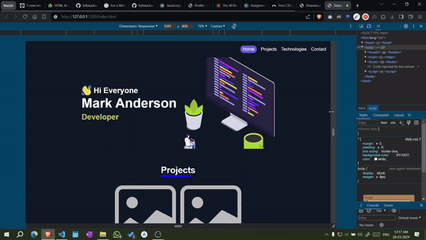

# Media Query Assignment

## Objective
The objective of this assignment is to demonstrate the use of media queries to create a responsive web page. We need to collapse the navigation bar into a hamburger menu when the screen width is less than 576px. And make images gallery vertically aligned when the screen width is less.

## Technologies Used
- HTML5
- CSS3

## Live Demo

[Media Query Assignment](https://divyam-kumar-pandey.github.io/Media-Query-Assignment2/)
